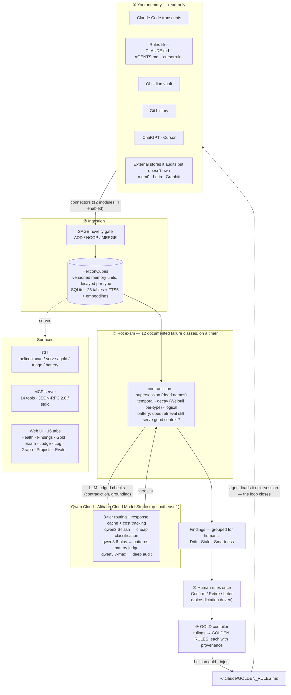
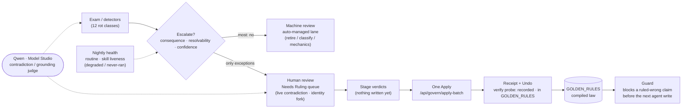

# Mount Helicon — Architecture

**A test layer that lives *outside* the memory store.** It reads an AI coding agent's memory read-only, regression-tests it for rot on a timer, asks the human to rule only on what's uncertain, and compiles those rulings into GOLDEN RULES the agent loads next session — closing the loop so corrections stick.

Numbers below are from the live database (`data/helicon.db`), not illustrative.

Store counts are deliberately **not** written here. `docs/architecture.svg` said "1,268 cubes, 91 reviewed" until 2026-07-17, by which point the store was ~6x that, and this file said "~6,900 / ~3,800" while a scan was adding 270 more. A count is a fast fact with a shelf life; a diagram is the slowest thing in a repo to update. Putting one inside the other guarantees rot, which is the exact failure class R2 exists to catch, and nothing was watching the diagram. Run `helicon doctor` for today's count.

## System diagram



## The operator-day loop (the Memory OS spine)

Govern by exception: the machine handles the bulk, the human rules only exceptions,
one Apply propagates with a receipt, and the guard protects the next agent write.



*Roadmap (not shown as working): a `TaskRun`/`ContextPacket` loop feeding a causal
consequence signal back into the escalation decision, and a reproducible A/B
comparison surface. See `HELICON_OS_FEATURE_MAP.md`.*

## Where Qwen Cloud does the work

The core rot checks (contradiction, staleness, dead-name detection) run **without an LLM** — deterministic, offline, fast. Qwen is called only where judgment is load-bearing, and the model tier is chosen per operation:

| Tier | Model | $/1K tok | Used for |
|---|---|---|---|
| fast | `qwen3.6-flash` | 0.0003 | novelty gate, cheap classification |
| default | `qwen3.6-plus` | 0.0008 | pattern learning, context-quality battery (contradiction + grounding judge) |
| deep | `qwen3.7-max` | 0.0024 | the meta-audit that challenges stored conclusions |

Routing, a response cache (`qwen_cache` table), and per-operation cost tracking live in `helicon/qwen.py`. The client speaks the OpenAI-compatible API against **Alibaba Cloud Model Studio** (`token-plan.ap-southeast-1.maas.aliyuncs.com`).

## Proof of Alibaba Cloud deployment

`scripts/cloudshell-run.sh` runs the full backend inside **Alibaba Cloud Shell** in slim mode (skips torch/sentence-transformers so it fits the shell's disk; semantic search degrades to keyword, everything else works from the DB). The Qwen calls go to the Model Studio endpoint above. That script is the code-file proof; the short screen recording accompanies the submission.

## The loop, in one pass

```
agent output (any platform)
  → connector extracts section-level items
  → SAGE novelty gate: ADD / NOOP / MERGE
  → HeliconCube stored (content hash, confidence, type, embedding)
  → Weibull decay applied per type (κ shapes the forgetting curve)
  → rot exam runs on a timer: 12 failure classes, most LLM-free
  → auto-triage clears the high-confidence rot from learned patterns
  → only uncertain findings surface, grouped Drift / Stale / Smartness
  → human rules once (Confirm / Retire / Later), voice-driven
  → ruling compiles into GOLDEN RULES with provenance
  → helicon gold --inject writes ~/.claude/GOLDEN_RULES.md
  → agent loads it next session; the same correction never drifts back
  → the exam re-runs nightly; a returning rot re-alarms
```

## Storage (26 core tables + FTS5)

`helicon_cubes` (memory units) · `reviews` · `patterns` · `audit_log` · `retrieval_log` · `scan_log` · `entities` · `edges` · `entity_aliases` · `consolidations` · `qwen_cache` · `session_summaries` · `triage_log` · `eval_runs` · `score_history` · `battery_history` · `playbooks` · `memory_utility` · `cube_embeddings` · `context_snapshots` · `regret_events` · `rules` · `route_evidence` · `run_cards` · `judge_runs` · `govern_batches`

Plus `cubes_fts`, the FTS5 full-text index. It is an index rather than a table the count claims, which is why 25 is the number checked against `CREATE TABLE` in source.

## Research the design draws on

| Technique | Source | What Helicon uses |
|-----------|--------|-----------------|
| Versioned memory units | MemOS (SJTU, 2025) | HeliconCubes with metadata + content hash |
| Multi-axis consistency audit | Memory Bear (2025) | temporal / factual / logical checks |
| Non-uniform forgetting | SSGM / LiCoMemory (2026) | Weibull decay, κ per memory type |
| Novelty gate at ingestion | SAGE (2026) | ADD / NOOP / MERGE |
| Retrieval learning | MetaMem (ACL 2026) | track surfaced-vs-acted, Q-value utility |
| Anti-confabulation | Honest Lying (2026) | challenge stored conclusions |
| Session summaries | Hermes Agent (2026) | structured docs from finished sessions |
| Context injection | ByteRover (2026) | past decisions injected via MCP |

Full pitch and failure-record citations (WikiContradict, STALE, the closed-"not planned" mem0 issues) are in `README.md` and the submission text.
