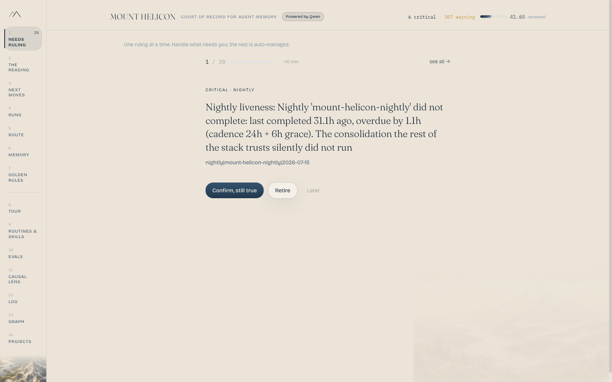
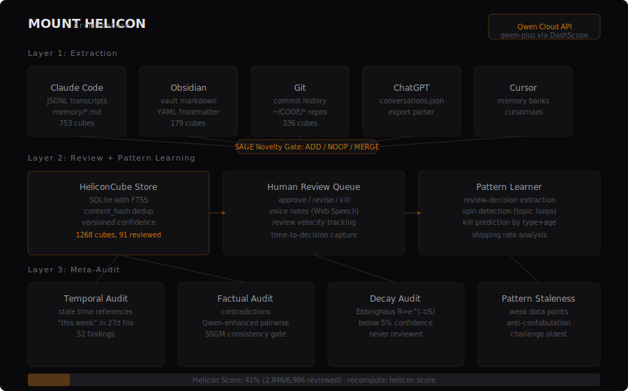

# Mount Helicon

<p align="center">
  
</p>

**The test-and-focus layer for AI agent memory.** Mem0 stores it, Letta organizes it, Zep timestamps it — none of them test whether what's remembered is still *true*. Mount Helicon is the exam: it regression-tests what your agent retrieves, scores whether that context is still true, retires what isn't, and turns what's left into your next move — every answer citing the exact memory it came from. **CI for memory, with receipts.**

It sits *on top of any store* (or none), reads any agent's memory read-only — Claude Code, Cursor, Copilot, Cline, ChatGPT, git, Obsidian, or a Mem0/Letta/Graphiti store — and never becomes a store itself.

Built for the [Qwen Cloud Global AI Hackathon](https://qwencloud-hackathon.devpost.com/) -- Track 1: MemoryAgent.

> **Where this is heading:** the calm **control plane for agentic work** — as your
> work fragments across Claude Code, Cursor, Codex, and cloud agents, Helicon keeps
> one inspectable system of record: what's true now, what changed, what it cost, and
> the three things worth your judgment. This submission ships the governance
> foundation of that vision. The full north star: [`VISION.md`](VISION.md).

## See it in 60 seconds (one command, no key, no personal data)

```bash
git clone https://github.com/MorkeethHQ/mount-helicon.git && cd mount-helicon
pip install -e .
helicon demo          # seeds a labelled demo store + opens the dashboard
```

Open **http://127.0.0.1:8420**. The dashboard opens on **Needs Ruling** with a
*dangerous* contradiction from a live payments store — *"Stripe is in test mode
(March) vs. we went live, every charge is real money (July)."* Believe the stale
one and an agent charges real customers. **One tap** on the current answer and it's
ruled — compiled into the law, and the receipt proves the **guard now blocks** the
dangerous claim before an agent can act on it, with **Undo**. That's the whole loop:
**a claim → its evidence → your ruling → enforced protection.** Localhost-bound,
keyless, scans nothing on your machine. Full walkthrough:
[`GOLDEN_SUBMISSION.md`](GOLDEN_SUBMISSION.md).

## The Problem

The record is measured and it is bad. Shown two contradicting sources, GPT-4 flags the conflict only **6.3%** of the time -- it just picks one and answers confidently ([WikiContradict, NeurIPS 2024](https://arxiv.org/pdf/2406.13805)). The best frontier model detects that a stored memory has been invalidated **55.2%** of the time ([STALE, 2026](https://arxiv.org/pdf/2605.06527)). **64% of memory-agent recommendation errors trace to outdated memory that was never forgotten** ([Memora, 2026](https://arxiv.org/html/2604.20006v1)), and accuracy on superseded facts collapses from 68% to 28% as session history grows -- 24x more memory buys back zero points: "the bottleneck is memory maintenance, not comprehension" ([Supersede, 2026](https://arxiv.org/html/2606.27472)). Independent production testing of a popular OSS memory store measured **49% effective accuracy after 30 days at a 38% staleness rate** ([RankSquire Infrastructure Lab, 2026](https://ranksquire.com/2026/05/06/long-term-memory-for-ai-agents/)).

The labs know. OpenAI's Agents SDK docs say it verbatim: *"Memory can become stale. Agents are instructed to treat memories as guidance only."* Anthropic's memory-tool freshness strategy is one line: delete files *"that haven't been accessed in a long time."* Alibaba's own AnalyticDB team titled their blog *"Is Your AI Agent Getting Dumber?"* -- and Qwen3.7-Max markets 35-hour autonomous runs as *"resilient to context rot and instruction drift"* with no way for anyone to verify it. Mem0 ($24M) stores. Letta ($10M) organizes. Zep timestamps. Every shipped mitigation is recency deletion, write-time dedup, or "the human should review." **Nobody ships a test that asks: is this stored memory still true?**

Mount Helicon is the exam. It runs on real data only -- this repo was built and tested against its author's live memory store (~7,800 memories as of 2026-07-17, roughly 4,200 of them live; it grows on every scan, so run `helicon doctor` for today's count), and it has failed its own audits more than once (see receipts in the demo).

## The moat: what a memory store cannot do (one command)

Mem0 stores. AgentPrizm confidence-scores. Both keep what an agent wrote. Neither can **examine whether two memories disagree on what an entity IS**, catch a **relationship no source ever grounded**, make a **ruling stick** so a corrected mistake cannot silently return, or **turn that ruling into policy** the next generation obeys. Those are four things a store structurally cannot do — and they are the exam.

```bash
python3 scripts/demo_mem0_audit.py --mock     # audits a Mem0-format store, no key
```

Four phases, on a store's own memories:
1. **Audit** — catches an **identity fork** (`Aurora` defined as a *payments protocol* in one memory, a *lending market* in another) and a **phantom association** (`Aurora → Solana`, asserted once, grounded by nothing). R11 and R12 — blind spots no confidence score reveals.
2. **Rule** — you settle each; Helicon records the verdict *and compiles it into the Golden Rules the agent reads before it writes* (`Aurora IS a payments protocol (ruled canonical); the 'market' framing is wrong`). A store keeps both contradictory memories; Helicon turns your verdict into policy — the *govern* half a store has no place to put.
3. **Re-audit** — clean. The rulings stuck.
4. **Recurrence** — a new memory re-asserts the ruled-out definition, and Helicon **re-alarms**. A store forgets it ever asked; Helicon remembers what you ruled.

Same story in the dashboard: `python3 scripts/demo_seed.py && HELICON_CONFIG=config-demo.json helicon serve` → rule the fork and the phantom in the review queue, watch them clear.

## Why it fits Track 1 (MemoryAgent)

**Memory stores remember. Mount Helicon judges what is still true.** It is itself a memory agent: it accumulates findings, human rulings, Golden Rules, regret events and retrieval failures across sessions, and uses them to make future agent decisions more accurate.

| Track 1 criterion | Mount Helicon's answer |
|---|---|
| **Persistent memory / accumulates experience** | Findings, rulings, Golden Rules, regret ledger and score history persist in SQLite across every session |
| **Remembers preferences** | Auto-triage learns keep/kill rules from *your* past rulings; Golden Rules encode your standing decisions with provenance |
| **Improves decisions across sessions** | Rulings compile into Golden Rules the agent obeys next session; the never-twice guard stops a corrected fact silently resurfacing |
| **Efficient store / retrieve** | Hybrid FTS5 + semantic retrieval; the battery tests what a task *actually* retrieves, not the whole store |
| **Timely forgetting** | 12-class rot exam + per-type Weibull decay + `reconcile` retires memories reality no longer contains |
| **Recall within limited context** | Selectors + retrieval-quality battery + Next Moves surface only what matters, each citing its source |
| **Qwen Cloud, load-bearing** | Contradiction + grounding judging, cross-source adjudication, rule compilation, and Next Moves synthesis — cached, cost-tracked, honest keyless degrade |

## Quick Start (60 seconds, $0)

```bash
git clone https://github.com/MorkeethHQ/mount-helicon.git
cd mount-helicon
pip install -e .

helicon init        # auto-detects Claude Code, Cursor, Obsidian, git
helicon scan        # extract memory from your sources
helicon doctor      # health check: PATH, config, key, DB, last scan
helicon check "what am I working on"   # context-quality verdict
helicon audit         # the rot exam: 12 documented failure classes, checked live
helicon serve       # dashboard at http://localhost:8420
```

**Bring your own Qwen key (BYOK).** Get one free on the [Alibaba Cloud Model Studio free tier](https://www.alibabacloud.com/en/product/modelstudio), set `QWEN_API_KEY` or put it in `config.json`. The OpenAI-compatible endpoint is `https://dashscope-intl.aliyuncs.com/compatible-mode/v1`. **Keyless degrade:** without a key every deterministic test still runs; only the two LLM-judged tests (Contradiction, Grounding) switch off -- the battery says so instead of faking a verdict.

Judge reproduction from a clean machine is scripted: `bash scripts/judge-check.sh` clones, installs, boots, and fails loudly on any crack. `scripts/cloudshell-run.sh` is the same flow inside Alibaba Cloud Shell.

## Proof of Alibaba Cloud

The backend is **deployed and running on Alibaba Cloud** — a live public URL:

- **Live on Alibaba Cloud ECS (Singapore / ap-southeast-1):** **http://47.237.3.97:8420** — `GET /api/health` → `{"status":"ok",...}`, `GET /` → the dashboard (HTTP 200). Serves the seeded demo store (no personal data). Reproducible on any Linux host via [`scripts/cloudshell-run.sh`](scripts/cloudshell-run.sh) (local-first).
- **Qwen inference on Alibaba Model Studio** — [`helicon/qwen.py`](helicon/qwen.py) (load-bearing: contradiction + grounding judging).
- **Embeddings on Alibaba DashScope** — [`helicon/embeddings.py`](helicon/embeddings.py) (`text-embedding-v4`).
- **Also container-deployable to Function Compute** — [`fc/s.yaml`](fc/s.yaml) + [`fc/Dockerfile`](fc/Dockerfile).

## Three ways to run it (the dashboard is optional)

You don't have to host anything, and you don't need the browser.

- **CLI** — `helicon audit`, `helicon check "<task>"`, `helicon doctor`, `helicon policy`. The full audit, headless. `helicon watch` runs it on a cron and only pings you when something *new* rots — the ambient, no-browser daily loop.
- **In your IDE / agent (MCP)** — `helicon mcp` exposes 16 tools so your coding agent audits and repairs its own memory mid-conversation: `helicon_context` pulls memory *with provenance*, `helicon_flag` corrects at the point of use, `helicon_stale`/`helicon_contradictions` surface rot. This is the agent-native path — the tool lives inside Claude Code / Cursor, no human dashboard required.
- **Dashboard** (`helicon serve`) — for when you want to sit down and review visually: Next Moves, findings, golden rules.

Packaged as a proper CLI (a `helicon` entry point via `pyproject.toml`), so once it's on PyPI the install is `pipx install mount-helicon` (or `uvx mount-helicon` for zero-install). Today, from the clone: `pip install -e .`, then `helicon init`. Semantic search is an optional extra (`pip install "mount-helicon[embeddings]"`); the core install is slim (no torch) so the CLI, the rot exam, and CI stay fast.

## CI for agent memory (GitHub Action)

The rot exam runs in CI, so a pull request that drifts your agent's instruction files fails the build — CI for memory, literally. `helicon ci` scans a repo's committed `CLAUDE.md` / `AGENTS.md` / `.cursorrules` / `.clinerules` / copilot-instructions, runs the 12-class deterministic exam (no key, no torch, no LLM), emits GitHub annotations + a job-summary table, and exits non-zero on rot.

```yaml
# .github/workflows/memory-ci.yml
name: memory-ci
on: [push, pull_request]
jobs:
  rot-exam:
    runs-on: ubuntu-latest
    steps:
      - uses: MorkeethHQ/mount-helicon@main
        with:
          fail-on: rot   # or 'none' for report-only
```

Locally it's the same one command: `helicon ci` (add `--fail-on none` for report-only). This repo dogfoods it — see `.github/workflows/memory-ci.yml`.

## Headline Features

- **`helicon snapshot`** -- regression tests for retrieved context. Capture what a task retrieves today; `snapshot check` fails when tomorrow's retrieval drifts. CI for memory.
- **`helicon check "<task>"`** -- context-quality battery on what a task retrieves: Relevance, Freshness, Redundancy, Thinness, Expiry (deterministic) + Contradiction, Grounding (judged live by Qwen). Verdict: HEALTHY / DEGRADED / BROKEN. Every verdict prints the age of the last scan, because a DEGRADED verdict is uninterpretable if the scan itself is stale. `--json` for scripts and CI.
- **`helicon reconcile`** -- timely forgetting. Re-scans sources and retires memories reality no longer contains (dry-run by default, never touches human decisions). On the live DB it retired 20 superseded memories in its first run.
- **`helicon fix-skills`** -- write-back: Qwen writes missing descriptions into your agent skill files (dry-run by default, `.bak` backups). It fixed 7 of this project's own skills.
- **`helicon doctor`** -- five checks (PATH, config, key, DB, last scan), exit 1 on failure. The front door to a daily loop.
- **`helicon rule "<natural language>"`** -- prompted rules. Qwen compiles your sentence to a restricted predicate (whitelisted fields, never code); before approval you see coverage, samples, empirical precision against YOUR past decisions, and conflicts with other rules. One approved rule governs hundreds of items; applied rules are never counted as human evidence.
- **The regret ledger** -- killed memories become a ghost list (LeCaR cache-eviction mechanics). When retrieval wants one back, a time-decayed regret event blames the exact decision that killed it, and FINDINGS shows "you retired this, retrieval wanted it 2x since -- restore?". Wrong forgetting is measured, not assumed.
- **`helicon_flag` over MCP** -- point-of-use correction. Injected memories carry id + last_verified + used_count; the agent (or you, through it) flags stale/wrong/useful in one call. Flags become findings the human confirms -- the agent proposes, it never deletes.

## Three Layers

**Layer 1 -- Extraction.** Nine pluggable connectors: Claude Code (JSONL transcripts + memory files), Obsidian, git history, ChatGPT exports, Cursor, agent rules files, plus read-side adapters for **Letta MemFS**, **Graphiti** (bi-temporal metadata mapped into memories; 17 tests), and **Mem0** -- the store Alibaba's own agent-memory docs recommend (Model Studio Memory Bank, Mem0 + Hologres, Mem0 + AnalyticDB), so Mount Helicon audits the stacks Alibaba itself suggests. Rewritten and expiring Mem0 memories carry their temporal fields into the freshness tests. Agent *rules* files (CLAUDE.md, AGENTS.md, .cursorrules) are split into section-level memories so regression catches a single rule drifting. Every item becomes a **HeliconCube**: versioned memory unit with source, confidence, content hash, review status, decay parameters (MemOS-inspired). A SAGE-style novelty gate (ADD/NOOP/MERGE) prevents redundant storage.

**Layer 2 -- Review pattern learning.** Weibull forgetting curves with per-type shape (cliff decay for code, long tail for decisions). Auto-triage derives kill/approve rules from HUMAN reviews only -- its own decisions are excluded so it cannot reinforce its own echo. On its first run it handled 585 of the 1,268 memories the store held at that time autonomously. Spin detection, kill prediction, Helicon Score.

**Layer 3 -- Meta-audit.** The system audits its own stored patterns: temporal staleness ("this week" in a 27-day-old file), factual contradictions (Qwen-judged), decay, pattern staleness, anti-confabulation challenges. The human reviews the memory review.

## Qwen Cloud API usage (where the LLM is load-bearing)

| Tier | Model | Used for |
|------|-------|----------|
| fast | `qwen3.6-flash` | Memory summarization, novelty gate, skill descriptions |
| default | `qwen3.6-plus` | Battery judging (Contradiction, Grounding), factual audit, Next Moves |
| deep | `qwen3.7-max` | Consolidation synthesis, optimization reports |
| retrieval | `text-embedding-v4` | Dense vectors (1024-dim) for hybrid + semantic search |
| retrieval | `qwen3-rerank` | Two-stage rerank over RRF-fused candidates |

All calls go through the OpenAI-compatible endpoint `https://dashscope-intl.aliyuncs.com/compatible-mode/v1` with a per-call SQLite response cache and per-operation cost tracking (`/api/tokens`). The two subjective battery tests are judged live and tagged `(qwen)` in output; if the judge call fails, the battery falls back to deterministic-only rather than fabricating a verdict.

## MCP Server (16 tools)

Agents audit their own memory mid-conversation. Add to `.claude.json`:

```json
{
  "mcpServers": {
    "helicon": { "command": "helicon", "args": ["mcp"], "cwd": "/path/to/mount-helicon" }
  }
}
```

| Tool | Description |
|------|-------------|
| `helicon_health` | Memory score and stats |
| `helicon_stale` | Decayed memories below threshold |
| `helicon_search` | Hybrid FTS5 + semantic search |
| `helicon_contradictions` | Active factual conflicts |
| `helicon_recent_reviews` | What the human approved/killed |
| `helicon_patterns` | Learned behavioral patterns |
| `helicon_guard` | Check a proposed claim against the compiled law *before* writing it: `blocked` / `warn` / `clean` |
| `helicon_ask` | Guarded retrieve — what is safe to believe about a topic: the ruled-true answer + retrieved context split into safe vs. ruled-wrong |
| `helicon_brief` | The morning brief — all five pillars in one call: truth, continuity, direction, reflection, calm |
| `helicon_portrait` | Grounded portrait of what the record shows about the person, plus its health |
| `helicon_context` | Proactive memory injection for a task -- every memory carries its id, last_verified, used_count |
| `helicon_flag` | Point-of-use correction: flag a memory stale/wrong/useful by id; stale/wrong become findings the human confirms |
| `helicon_playbook` | Task playbooks from review patterns |
| `helicon_compile` | Compile reviewed memory to injectable files |
| `helicon_triage` | Trigger auto-triage |
| `helicon_consolidate` | Run a consolidation (sleep) cycle |

The full JSON-RPC 2.0 handshake (initialize, tools/list, tools/call) is exercised in the receipts; `helicon mcp` runs the server on stdio, so the bare CLI never silently becomes a server.

## CLI (46 commands)

`init` `scan` `reconcile` `fix-skills` `serve` `demo` `triage` `review` `route` `score-runs` `runs` `judge-bench` `attribute` `move` `leaderboard` `snapshot` `lens` `taste` `check` `report` `read` `audit` `consistency` `volatility` `guard` `ask` `brief` `repair` `ci` `policy` `evolve` `resolve` `watch` `alias` `rule` `doctor` `mcp` `score` `stack` `optimize` `eval` `embed` `playbooks` `compile` `consolidate` `eval-consolidation`

Four of them answer to a second name, kept working so older muscle memory doesn't break: `battery` = `check`, `rot` = `audit`, `heal` = `repair`, `gold` = `policy`. Aliases, not extra commands, so they are not counted above.

`helicon route` turns output-verification into a **model-routing recommendation**: it reads the eval store — the verified verdicts `review --terminals` produced — and ranks models by Wilson-scored verified-pass-rate per task-class, with sample size and confidence attached. The model is attributed from the git co-author trailer of the commits that produced the output; the outcome is a real reality-check, never a guess. Below a sample threshold it says *insufficient evidence*, never a fabricated number. `helicon route --record --run` builds the evidence first. See [docs/ROUTE.md](docs/ROUTE.md).

`helicon score-runs` and `helicon runs` score whole RUNS, the same output-verification one level up and made cost-aware: `score = verified yield / cost - damage`. Cost comes from the real transcript token usage, yield from the `review --terminals` verdicts, damage from an incident flag. Every term traces to a real source; nothing is vibed. `score-runs --card` cuts one run card, `runs` renders the scored history, `runs --suggest` reads what to run next off it. See [docs/RUNS.md](docs/RUNS.md).

`helicon judge-bench` benchmarks Qwen as the memory-rot judge against the operator's own human rulings, and (with an OpenRouter key) against GPT/Claude on the same probes. Real result (run #2, 26 probes, 13 real contradictions + 13 controls, ground truth = the operator's own rulings): **qwen3.6-plus ties anthropic/claude-sonnet-5 at 0.962 accuracy and beats openai/gpt-5 (0.808)**, at $0.00444 per run and in 54s against Sonnet's 144s and GPT's 245s. qwen3.6-flash holds 0.923 for $0.00167, 8x cheaper than qwen3.7-max for the same specificity. And **every model, Qwen and Claude and GPT alike, missed `unit-drift`**: some rot is a domain ruling rather than a logical contradiction, and no judge at any price catches it. That is what the human-ruling layer exists for. Reproduce: `helicon judge-bench --set all --save` (needs `openrouter_api_key` for the competitors); the Judge tab reads the saved run, and renders an unrun bench as unrun. See [docs/ROUTE.md](docs/ROUTE.md).

`helicon move` is the context-mover: read memory from one platform, VERIFY each item (freshness, and with `--verify-contradictions` the Qwen judge), and render the survivors into another platform's native format (`claude-code` / `cursor` / `markdown`). Memory moves verified, never blindly; held-back items are listed with why. Dry-run by default; `--apply` backs up the target first.

`helicon leaderboard` is the population-scale version: it reads git history across many repos (where multiple models and harnesses actually co-authored commits) and ranks models by how often their commits SURVIVE vs get REVERTED, Wilson-scored. Execution-free (git only, so it is bounded and cannot freeze a machine); the revert is the honest failure signal. On 927 attributed commits across 25 local repos it already separates opus-4.6 / opus-4.8 / fable-5 / cursor by reliability.

`helicon repair` runs **the self-healing audit loop** — the thing no retriever can do. It scores the four truth gates (freshness / volatility / consistency / retrieval) on a store, surfaces each drift with its cross-source evidence, proposes a repair (retire the stale memory, move a fast fact to the live layer) as a diff you accept, applies the accepted ones, and re-scores so the gates visibly move. `helicon repair --demo` runs it on a seeded, universally-legible store (the classic "I told my agent I'm vegetarian, then started eating chicken again — it never updated" contradiction, plus a stale goal and a fast fact); `--apply` closes the loop.

`helicon audit` runs **the rot exam**: the 12 documented memory-failure classes in [ROT.md](ROT.md) checked live against your real store -- deterministic, zero LLM calls, free to run daily. On this repo's own store it currently finds rot in several of 12 classes and says so — and as of Jul 5 all 12 classes are fully tested, 0 partial.

`helicon watch` makes the exam ambient: scan + selectors + rot exam on a timer (`helicon watch --install` writes the crontab line, every 6h), diffed against the last run. You get a macOS notification and a `drift-report.md` only when something NEW rots — no news, no noise. First run baselines silently.

`helicon policy` compiles **GOLDEN RULES**: the stack's law, built from your rulings, dismissal precedents, approved triage rules, declared renames, canonical sources and standing feedback — every rule with its provenance (a rule without provenance is a vibe). `--inject` writes it to `~/.claude/GOLDEN_RULES.md` (dry-run default, `.bak` kept) so every session can obey it. `helicon evolve` is the night command: scan, every selector, the exam, a gold recompile, and the morning delta — what your stack learned while you slept.

`helicon report` prints a **MemoryAgent Compliance Report**: the track's four sub-goals (efficient storage/retrieval, timely forgetting, recall under limited context windows, cross-session accuracy) scored live from your real memory, thresholds printed with the numbers. Any memory stack a connector can scan could be graded by the same exam.

## Audit a store you don't own

The exam is not limited to your own memory. Any repo with a committed agent-rules file (AGENTS.md, CLAUDE.md, .cursorrules, ...) is a memory store someone's agent obeys every session — so it can be examined:

```bash
bash scripts/demo_public_store.sh          # default: openai/codex AGENTS.md
```

This replays the file across its REAL git history (no staging): ingests an old commit, snapshots retrieval, replays to HEAD, reconciles, runs the rot exam. On openai/codex (27 real commits of AGENTS.md edits, cited by SHA in the output): 5 sections retired as drifted, 1/1 retrieval snapshot regressed — R10 and R8, live, on a store we don't own. Reproducible by anyone.

## The life-OS benchmark — scored against human-labeled rot

On Jul 5 a 5-agent manual audit swept the operator's real second brain (Obsidian vault + Claude Code memory dir), archived 33 stale docs and stamped 21 drifting docs with dated `> **LOUPE` correction banners. Those banners are a labeled dataset of real memory rot. The benchmark ingests the same corpora with the banners stripped (the answer key never enters the input) and scores the deterministic detectors against them:

```bash
python3 scripts/rot_bench_lifeos.py    # read-only on sources, throwaway DB, zero LLM
```

Honest numbers from the first run (232 files, 1,667 section memories): **6/16 file-level catches, 4/16 strict facet-match** — the output labels the difference itself. What it caught: both merge-status flips (audit doc still said 'NOT patched' after the fix merged), a stale dashboard doc, a dead 7-week-old plan. What it found that the humans missed: a win-count fight (9 vs 10) living in the resume and two application drafts, and 35 files still asserting a dead project name post-rebrand. Named misses, on the roadmap: overlapping-date-range drift (Aug 14-22 vs Aug 15-24 overlap, so interval semantics reads agreement), living-doc supersession without a declared rename, and content-based staleness (a young file asserting old facts).

## Access & trust model (read this before connecting your vault)

A tool that audits your memory reads your memory. That access is scary, so here is exactly what Mount Helicon does with it — from the code, not a promise:

**Reads (always read-only):** your configured sources — Claude Code transcripts, Obsidian vault, git repos, rules files, memory stores via adapters. Connectors never write to a source. The life-OS benchmark and the rot exam open the store read-only.

**Writes, exhaustively:**
- its own SQLite DB and `data/` (findings, verdicts, drift reports, compiled context)
- `helicon fix-skills` and other write-backs: **dry-run by default**, `--apply` required, `.bak` written next to every file before modification, second run is a no-op
- `helicon watch --install`: one tagged line in your crontab, removed by `--uninstall`
- `helicon compile`: compiled context files under `data/compiled/` (`--output` redirects). It writes nothing into `~/.claude/`: an auto-inject path exists in the source (`compiler.inject_into_claude_code`) but no command calls it, so the pull path (`helicon_context` over MCP) is the working half of that loop and the push half is unwired. Our own store still carries pre-rename `glaze-*` skill files from an older injector, which the skills audit flags: a live example of why write-backs need lifecycle discipline
- `helicon policy --inject` (alias `helicon gold --inject`): `~/.claude/GOLDEN_RULES.md`, dry-run by default, `.bak` kept
- your vault: **never**. Corrections are memories in Helicon's store, not edits to your files. You stay the only writer of your second brain.

**Leaves your machine:** nothing, unless you configure a Qwen key — then excerpts of candidate memories (truncated content) go to the model for judging, and the response is cached locally. Keyless mode runs every deterministic check with zero egress and says so instead of degrading silently.

**Decisions:** every destructive or state-changing action (kill, retire, resolve, dismiss, rule application) is either made by you or made by a written rule you previewed and approved — and automated decisions are quarantined from the learning loop (rot class R9), so the tool cannot launder its own output into your evidence.
## Your domain, your lexicon (config, not code)

The claim-conflict detectors ship with built-ins (win counts, episode numbers, merge status, decision status) and take the rest from `config.json` — an enterprise wiki or research vault declares its own counted things and polar statuses, and gets the same conflict machinery, evidence receipts and resolve loop:

```json
"claims": {
  "metrics":   {"headcount": "\\b(\\d{2,5})\\s+employees\\b"},
  "statuses":  {"contract": {"live": "contract (is )?live", "expired": "contract (is )?expired"}},
  "canonical": {"wins": "mindmap.md"}
}
```

`canonical` encodes the single-source-of-truth rule: declare WHERE a fact's truth lives, and a conflict files as *"Drift from canon: canon says 9; 8, 10 asserted elsewhere"* — the human confirms a pre-decided direction instead of adjudicating from scratch.

Doc honesty is enforced: `python3 -m helicon.docdrift` compares this README's numeric claims against counts computed from source, and it runs in the test suite — stale docs fail the build. (It caught this very README claiming 20 commands the hour the 21st landed.)

Everything destructive is dry-run by default and takes `--apply`.

## Honest eval numbers

- Composite: **~67** (live, as of 2026-07-13 — run `helicon eval` to recompute; retrieval P@3 + MRR + decay-AUC; audit axis excluded -- no labeled ground truth).
- Retrieval: P@3 0.615, MRR 0.596. Small internal benchmark (n=13, one label per query) -- disclosed, not hidden.
- **Decay predicts human kills at rank-AUC 0.78** (mean confidence of killed memories 0.14 vs approved 0.27). A real, independent signal.
- Consolidation: ~9-10x fewer tokens; Qwen-judged quality favors synthesis (self-graded, shown as direction, not proof).
- Zero fake data anywhere: the demo DB is the author's real Claude Code transcripts (210+), Obsidian vault, and git repos.

## Built on established patterns, extended

Mount Helicon's capabilities stand on well-understood memory-systems patterns and take each one further. The lineage, stated honestly — the second column is the established idea, the third is our own build on top of it:

| Capability | Established pattern | How Mount Helicon extends it |
|-----------|--------|---------------------------|
| Versioned memory units | Structured memory units, not raw text | HeliconCube: source, hash, valid_from, confidence, decay per type |
| Multi-axis audit | Temporal/factual/logical consistency checks | 12-class rot exam, each with a receipt and a never-twice guard |
| Weibull decay | Non-uniform forgetting curves | Per-type kappa, and decay rank-predicts human kills (AUC 0.78) |
| Novelty gate | ADD/NOOP/MERGE at ingestion | Gate + provenance, so a merge never loses the source it came from |
| Anti-confabulation | Challenge claims against evidence | Grounding check + R12 phantom-association catch |
| Retrieval learning | Track surfaced vs acted-on | Q-value ranking rewarded by human rulings only — no self-echo |
| Identity & phantom coherence | *(ours — no store or prior system does this)* | R11 fork detection, R12 phantom catch, rulings compiled to law |

## Architecture

<p align="center">
  
</p>


- **Backend:** Python 3.12, FastAPI (95 endpoints), SQLite + FTS5 (29 tables). **Qwen-native retrieval when a Model Studio key is configured**: `text-embedding-v4` (1024-dim) dense vectors + FTS5, fused by Reciprocal Rank Fusion, then a `qwen3-rerank` two-stage pass — the whole retrieve→rerank stack on Alibaba Cloud (falls back to local MiniLM + linear fusion, FTS-only, when no key)
- **Frontend (optional):** React 19, TypeScript, Vite. Four surfaces — **Next Moves** (memory state → cited next prompts/goals, generated by Qwen, every move citing the memory it came from), **Memory** (sources, review coverage, health), **Needs Ruling** (every failed check with why/evidence/action, grouped Drift / Stale / Smartness), **Golden Rules** (rulings compiled with provenance, injectable). The dashboard is one of three interfaces (CLI · MCP-in-IDE · dashboard)
- **AI:** Qwen Cloud API via OpenAI-compatible SDK (see table above)
- **Distribution:** BYOK + local-first. Live deployment on Alibaba Cloud ECS at http://47.237.3.97:8420 (Singapore), plus Cloud Shell run (`scripts/cloudshell-run.sh`)

## License

MIT
